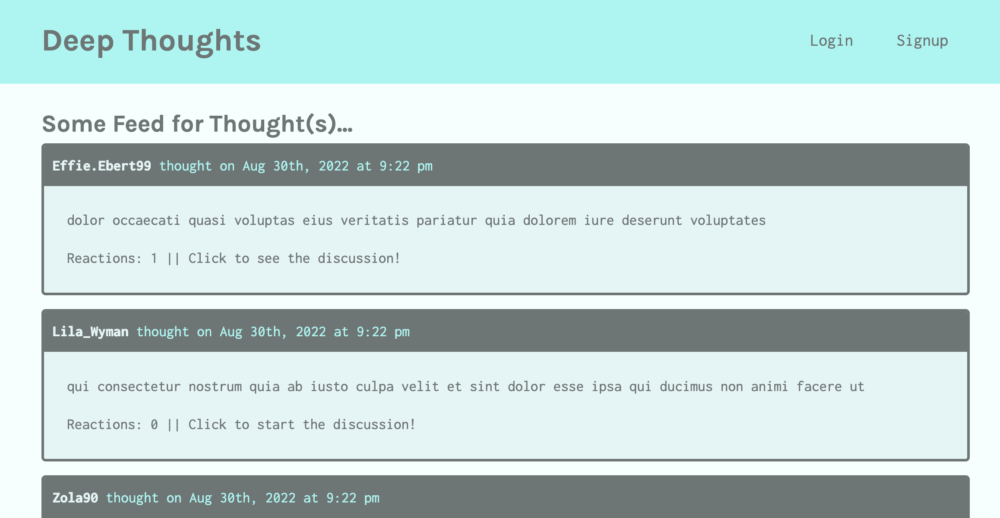

# Photo Port

## Table of Contents

- [Description](#description)
- [Education](#education)
- [Application](#application)
- [Questions](#questions)

## Description

This is a MERN social media application built using React, GraphQL, Apollo Server, and MongoDB following the steps of a course module.

## Education

Created the social network Deep Thoughts using React and Mongo to learn the following items:

- Integration of the Apollo Server GraphQL library to handle data requests.
- Build both query type definitions and resolvers for retrieving data from a MongoDB database.
- Apollo Studio Explorer interface to thoroughly test GraphQL queries.
- Use GraphQL mutations to handle updates to a database.
- Sign and verify JSON Web Tokens as part of the authentication process.
- Use the Apollo Client library to consume GraphQL APIs on the front end.
- Use Routes and Route components to set up client-side routing.
- Implement login functionality and user-based navigation in React.

## Application

[Link to Deployed Application](https://stormy-wildwood-32717.herokuapp.com/)

## Questions?

For any questions, please email gilinamcbride@gmail.com, or visit any other projects on [Github](github.com/gilinamcbride).
